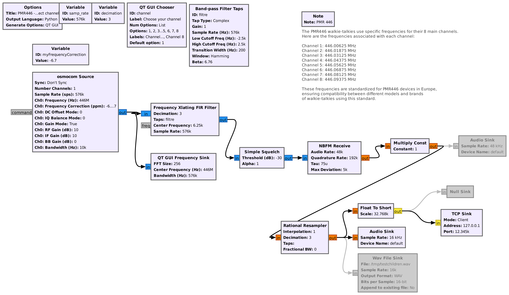
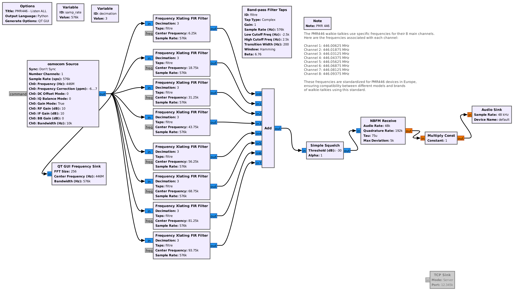

# Capturing Radio Communications via RTL/SDR and AI Speech-to-Text Transcription

## Overview

This experimental project captures radio communications from Private Mobile Radio (walkie-talkie) devices operating on the 446 MHz band, using the HackRF One or any compatible software-defined radio (SDR), and converts the speech to text in offline mode. 

- [Listen one selected PMR 446 MHz channels](#select-one-channel-for-real-time-speech-to-text) using HackRF One & GNURadio.
- [Automatically transcribe radio communications](#run-transcribepy) into text using **OpenAI's Whisper AI** (multi-language support).
- Bonus: [Listen to all PMR 446 MHz channels](#bonus--listen-all-pmr-channels) using HackRF One.

This project is ideal for enthusiasts and developers who want to bridge radio communications with modern AI transcription technologies.

<video controls src="https://private-user-images.githubusercontent.com/1298617/408893438-1a9ed5b1-5b20-44a0-99ba-39c2bb708ba9.mp4?jwt=eyJhbGciOiJIUzI1NiIsInR5cCI6IkpXVCJ9.eyJpc3MiOiJnaXRodWIuY29tIiwiYXVkIjoicmF3LmdpdGh1YnVzZXJjb250ZW50LmNvbSIsImtleSI6ImtleTUiLCJleHAiOjE3Mzg1MjUyMjEsIm5iZiI6MTczODUyNDkyMSwicGF0aCI6Ii8xMjk4NjE3LzQwODg5MzQzOC0xYTllZDViMS01YjIwLTQ0YTAtOTliYS0zOWMyYmI3MDhiYTkubXA0P1gtQW16LUFsZ29yaXRobT1BV1M0LUhNQUMtU0hBMjU2JlgtQW16LUNyZWRlbnRpYWw9QUtJQVZDT0RZTFNBNTNQUUs0WkElMkYyMDI1MDIwMiUyRnVzLWVhc3QtMSUyRnMzJTJGYXdzNF9yZXF1ZXN0JlgtQW16LURhdGU9MjAyNTAyMDJUMTkzNTIxWiZYLUFtei1FeHBpcmVzPTMwMCZYLUFtei1TaWduYXR1cmU9ZmIzZGY3Yjk1MDQwZjA3ZWQ4NGM1NmM5NDMyOTMwMzFlYTI1MDFmMGI1MzFlYWI2MDZlYjEwMzMzOTg2YTk0MSZYLUFtei1TaWduZWRIZWFkZXJzPWhvc3QifQ.cwAq00K8YkgfY8AaC-KBBIy2MDMtQ5J-d2PDSea5cjs" title="Title"></video>

### PMR446 Channels and Frequencies

PMR446 use specific frequencies for their 8 primary channels. Below are the frequencies associated with each channel:

- **Channel 1**: 446.00625 MHz  
- **Channel 2**: 446.01875 MHz  
- **Channel 3**: 446.03125 MHz  
- **Channel 4**: 446.04375 MHz  
- **Channel 5**: 446.05625 MHz  
- **Channel 6**: 446.06875 MHz  
- **Channel 7**: 446.08125 MHz  
- **Channel 8**: 446.09375 MHz  

These frequencies are standardized for PMR446 devices in Europe, ensuring compatibility between different models and brands of talkie-walkies that use this standard.

## Select one channel for real time speech-to-text

Prerequisites : 
- Gnuradio installed, my version is 3.10.1.1 (Python 3.10.12)
- Cuda driver (in my case with nvidia RTX4060)
- RTL/SDR Receiver
- My personnal correction for my device is -6.7 ppm (adjust as necessary)

[](./assets/pmr446-select-channel.png)

1. Run transcribe.py first ([See Run transcribe.py section](#run-transcribe-py)).
2. Run `pmr446-select-channel.grc` in GNURadio (setup ip/port)
3. Choose your channel
4. Speak over PMR device

### Run transcribe.py

```sh
pyenv --version # pyenv 2.4.17
python --version # Python 3.9.9
python -m venv .venv
source .venv/bin/activate
pip install -r requirements.txt
python transcribe.py --language fr # french speech, listen on 127.0.0.1:12345 by default
python transcribe.py --language fr --model turbo # by default turbo model is used 
```


## BONUS : Listen all PMR channels 

Prerequisites : 
- Gnuradio installed, my version is 3.10.1.1 (Python 3.10.12)
- RTL/SDR Receiver
- Multiple cpu core a required for this project - (1 core per xlating filter).
- My personnal correction for my device is -6.7 ppm (adjust as necessary)

[](./assets/pmr446-listen-all.png)

1. Run `pmr446-listen-all.grc` project
2. Speak over PMR device
